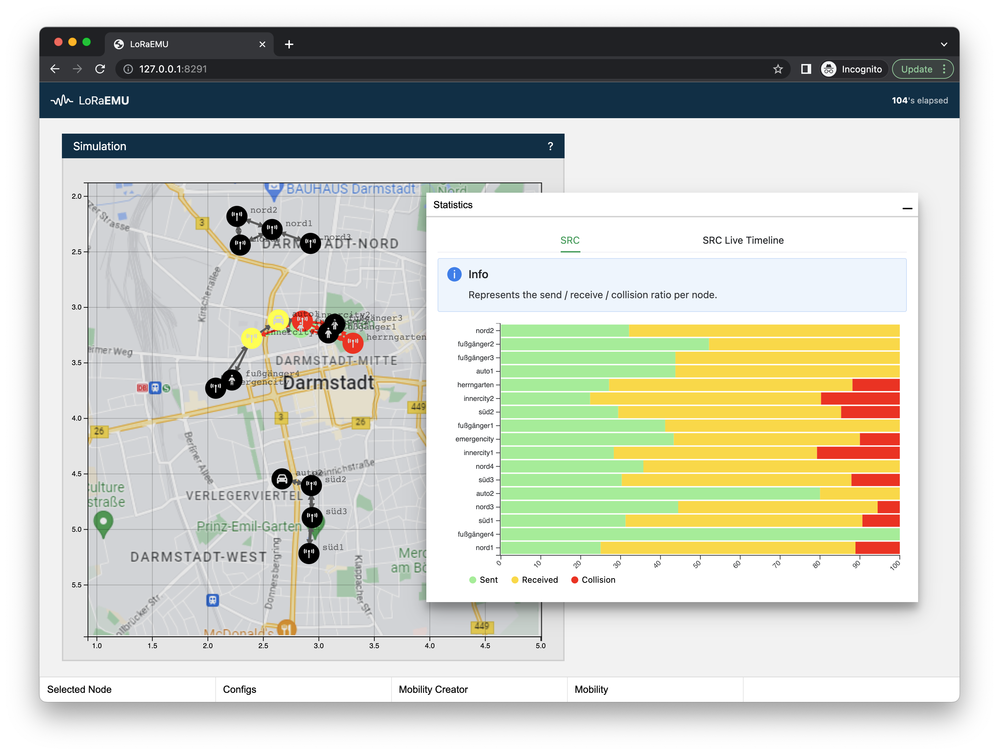

# LoRaEMU



[](https://pkg.go.dev/github.com/BigJk/loraemu)

LoRaEMU is a simple LoRa (not LoRaWAN) simulator written in go.

The idea is that for each node (which represents some kind of LoRa device) in the simulation you can connect to that device over websocket. Packets that are sent to the websocket are treated as LoRa packets and handled in the simulator. Any packets that the node receives in the simulation will be sent back over websocket.

## Features

- Uses [Log-Distance Path Loss](https://en.wikipedia.org/wiki/Log-distance_path_loss_model) with configurable gamma exponent to simulate dBm path loss between nodes
- Calculates airtime
- Detects collisions based on the airtime of sends
- Detects if a single signal is still strong enough to be received while collision
- Packets can be received and sent per node via websocket
- Web view to see a live view of the simulation and edit nodes
- REST API to fetch and modify nodes on the fly
- NS-2 mobility file support to dynamically move nodes

## Binaries

Check the **README.md** files of the cli binaries for more information on running LoRaEMU:

- **LoRaEMU**: ``/cmd/emu``
- **LoRaEMU Log Inspector**: ``/cmd/log-inspector``

## Log-Distance Path Loss Model

The model tries to model how radio waves propagate and predicts the path loss based on distance and the gamma value. The gamma value can be used to model certain environmental settings. Examples are:

| Environment                   | Gamma Value |
|-------------------------------|-------------|
| Free Space                    | 	2          | 
| Urban Area Cellular radio	    | 2.7 to 3.5  | 
| Shadowed urban cellular radio | 	3 to 5     |
| In building line of sight     | 	1.6 to 1.8 |
| Obstructed in building        | 	4 to 6     |
| Obstructed in factories       | 	2 to 3     |

## Collisions

If a node receives 2 or more packets at the same time this will result in a collision, which means packet decoding is not possible. The exception is the case of one signal being at least 6dBm stronger than all the other that are received at the time. LoRa can still decode this stronger packet successfully.

## Building All

To build LoRaEMU, it's utilities and the Frontend you need:

- [go](https://go.dev/) (at least ``1.18``) installed
- [NodeJS](https://nodejs.org/en/) with the ``npm`` command available

Then run:

```
./build_all
```